# فهرس لقطات الشاشة – منظومة تتبع الحمل عالي الخطورة

> تم الالتقاط بترتيب: 16 لقطة

| # | التسمية | اسم الملف |
|---|---------|-----------|
| 1 | شاشة تسجيل الدخول – منظومة تتبع الحمل عالي الخطورة | [01_شاشة_تسجيل_الدخول_–_منظومة_تتبع_الحمل_عالي_الخطورة.png](./01_شاشة_تسجيل_الدخول_–_منظومة_تتبع_الحمل_عالي_الخطورة.png) |
| 2 | لوحة المعلومات الرئيسية مع البطاقات الإحصائية والمخططات | [02_لوحة_المعلومات_الرئيسية_مع_البطاقات_الإحصائية_والمخططات.png](./02_لوحة_المعلومات_الرئيسية_مع_البطاقات_الإحصائية_والمخططات.png) |
| 3 | المخطط الدائري – توزيع مستويات الخطورة | [03_المخطط_الدائري_–_توزيع_مستويات_الخطورة.png](./03_المخطط_الدائري_–_توزيع_مستويات_الخطورة.png) |
| 4 | مخطط الأعمدة – حالة الالتزام بالمواعيد | [04_مخطط_الأعمدة_–_حالة_الالتزام_بالمواعيد.png](./04_مخطط_الأعمدة_–_حالة_الالتزام_بالمواعيد.png) |
| 5 | قائمة المرضى مع خيارات البحث والتصفية | [05_قائمة_المرضى_مع_خيارات_البحث_والتصفية.png](./05_قائمة_المرضى_مع_خيارات_البحث_والتصفية.png) |
| 6 | نموذج تسجيل مريضة جديدة | [06_نموذج_تسجيل_مريضة_جديدة.png](./06_نموذج_تسجيل_مريضة_جديدة.png) |
| 7 | ملف المريضة – البيانات الشخصية وقائمة الحالات | [07_ملف_المريضة_–_البيانات_الشخصية_وقائمة_الحالات.png](./07_ملف_المريضة_–_البيانات_الشخصية_وقائمة_الحالات.png) |
| 8 | البحث عن مريضة برقم الهوية قبل تسجيل حالة حمل | [08_البحث_عن_مريضة_برقم_الهوية_قبل_تسجيل_حالة_حمل.png](./08_البحث_عن_مريضة_برقم_الهوية_قبل_تسجيل_حالة_حمل.png) |
| 9 | تفاصيل حالة الحمل – وضع العرض مع زر تصدير PDF | [09_تفاصيل_حالة_الحمل_–_وضع_العرض_مع_زر_تصدير_PDF.png](./09_تفاصيل_حالة_الحمل_–_وضع_العرض_مع_زر_تصدير_PDF.png) |
| 10 | نافذة تصدير PDF لملف مريضة – البيانات الكاملة | [10_نافذة_تصدير_PDF_لملف_مريضة_–_البيانات_الكاملة.png](./10_نافذة_تصدير_PDF_لملف_مريضة_–_البيانات_الكاملة.png) |
| 11 | صفحة المواعيد – القائمة الكاملة مع خيارات التصفية | [11_صفحة_المواعيد_–_القائمة_الكاملة_مع_خيارات_التصفية.png](./11_صفحة_المواعيد_–_القائمة_الكاملة_مع_خيارات_التصفية.png) |
| 12 | نافذة طباعة جدول المواعيد | [12_نافذة_طباعة_جدول_المواعيد.png](./12_نافذة_طباعة_جدول_المواعيد.png) |
| 13 | صفحة التنبيهات – قائمة الحالات الحرجة | [13_صفحة_التنبيهات_–_قائمة_الحالات_الحرجة.png](./13_صفحة_التنبيهات_–_قائمة_الحالات_الحرجة.png) |
| 14 | صفحة التقارير – خيارات تصدير بيانات المرضى والحالات | [14_صفحة_التقارير_–_خيارات_تصدير_بيانات_المرضى_والحالات.png](./14_صفحة_التقارير_–_خيارات_تصدير_بيانات_المرضى_والحالات.png) |
| 15 | صفحة إدارة المستخدمين – قائمة الحسابات مع الأدوار | [15_صفحة_إدارة_المستخدمين_–_قائمة_الحسابات_مع_الأدوار.png](./15_صفحة_إدارة_المستخدمين_–_قائمة_الحسابات_مع_الأدوار.png) |
| 16 | شاشة تسجيل الدخول في التطبيق المحمول | [16_شاشة_تسجيل_الدخول_في_التطبيق_المحمول.png](./16_شاشة_تسجيل_الدخول_في_التطبيق_المحمول.png) |

## معاينة

### 1. شاشة تسجيل الدخول – منظومة تتبع الحمل عالي الخطورة

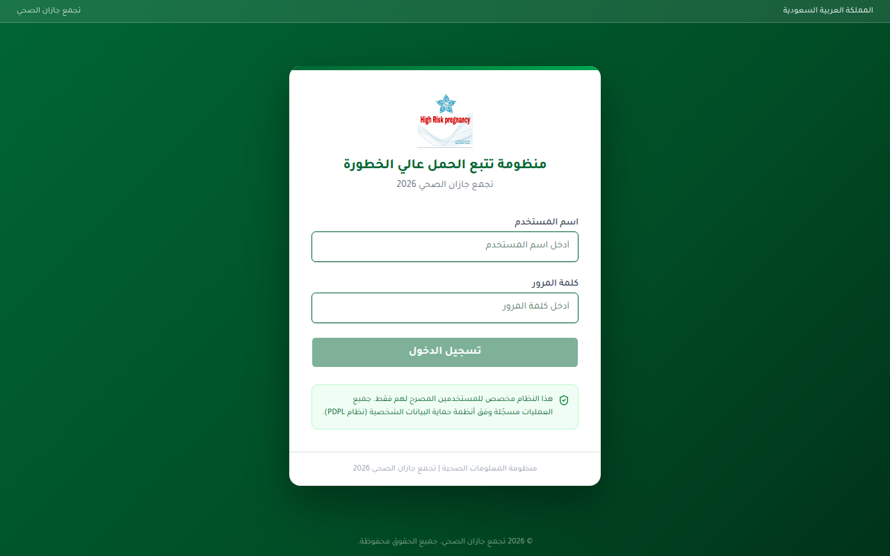

### 2. لوحة المعلومات الرئيسية مع البطاقات الإحصائية والمخططات

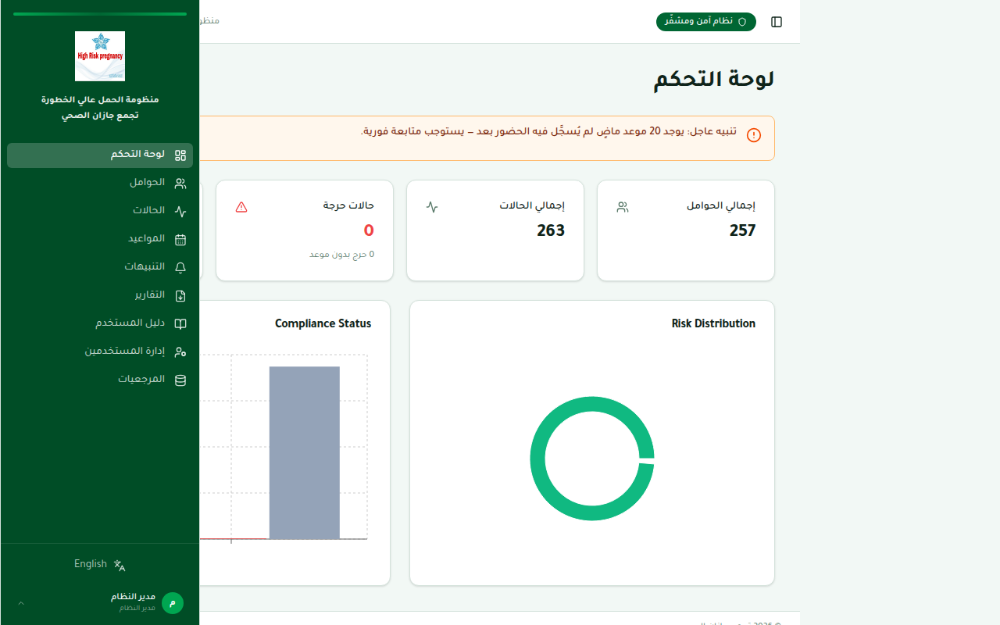

### 3. المخطط الدائري – توزيع مستويات الخطورة

### 4. مخطط الأعمدة – حالة الالتزام بالمواعيد

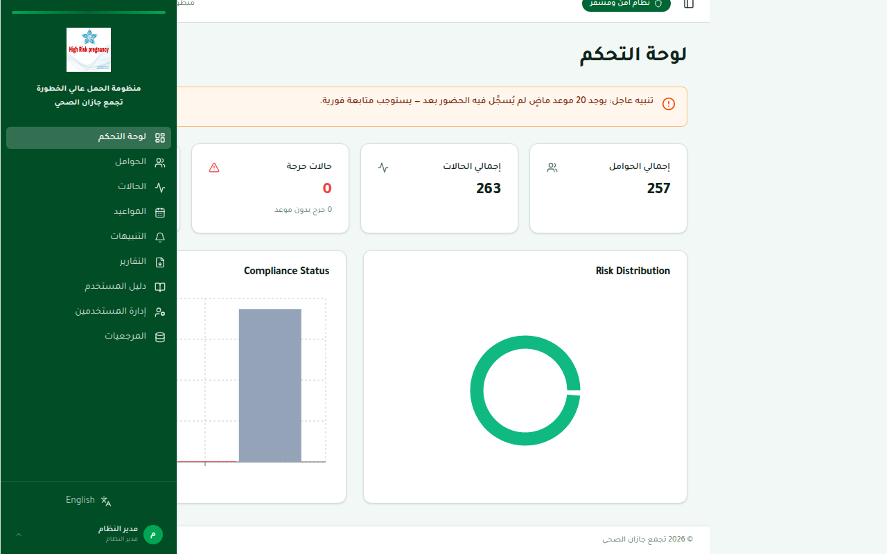

### 5. قائمة المرضى مع خيارات البحث والتصفية

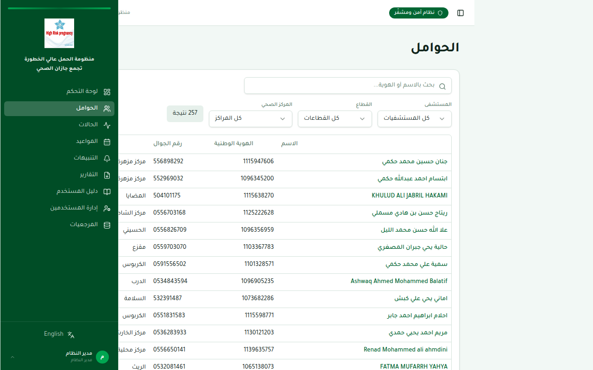

### 6. نموذج تسجيل مريضة جديدة

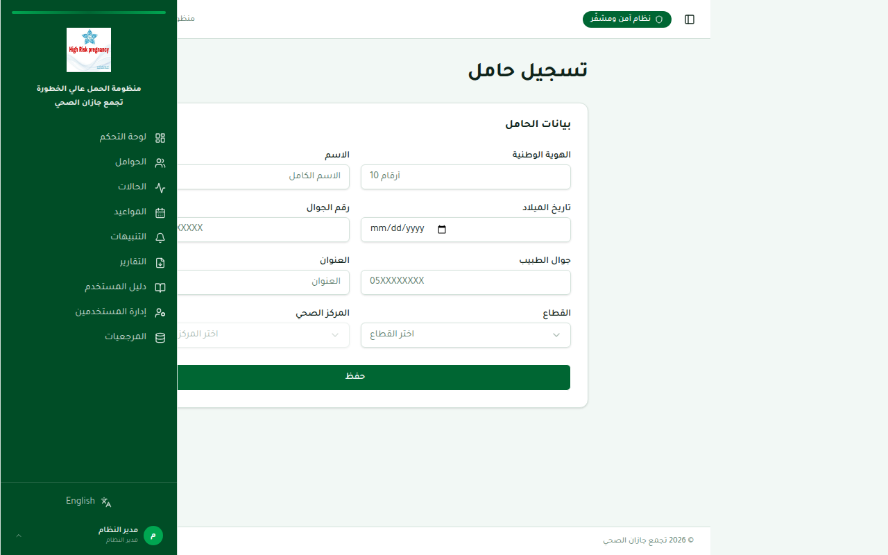

### 7. ملف المريضة – البيانات الشخصية وقائمة الحالات

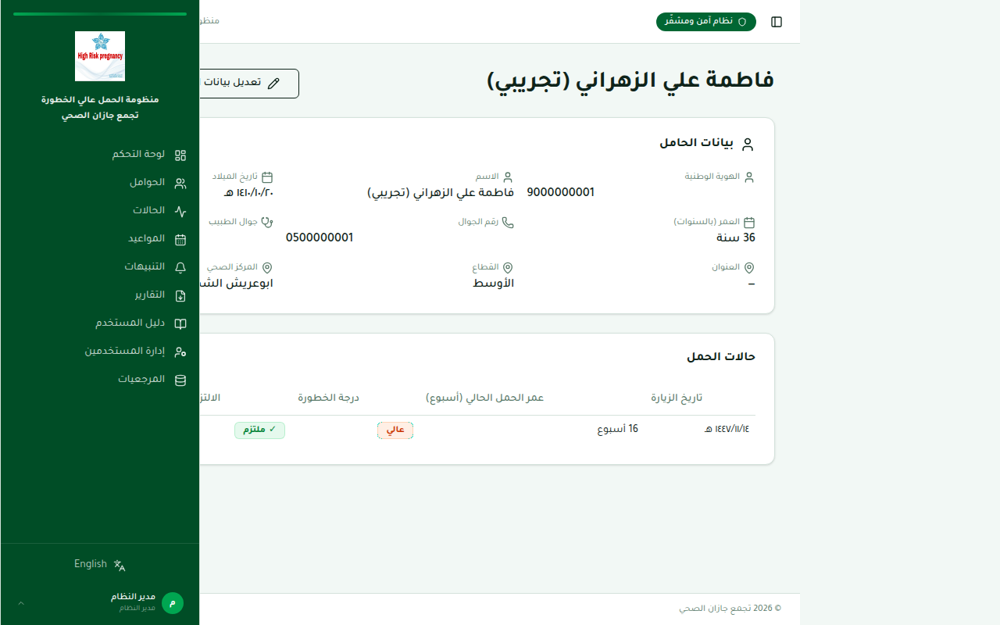

### 8. البحث عن مريضة برقم الهوية قبل تسجيل حالة حمل

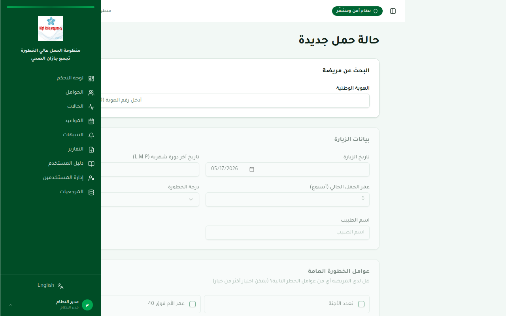

### 9. تفاصيل حالة الحمل – وضع العرض مع زر تصدير PDF

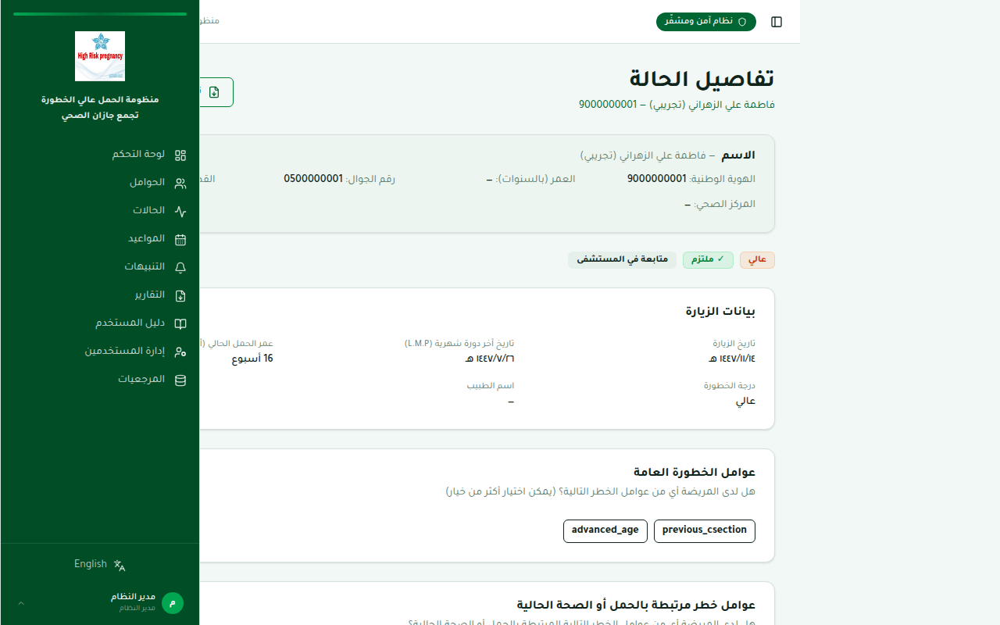

### 10. نافذة تصدير PDF لملف مريضة – البيانات الكاملة

### 11. صفحة المواعيد – القائمة الكاملة مع خيارات التصفية

### 12. نافذة طباعة جدول المواعيد

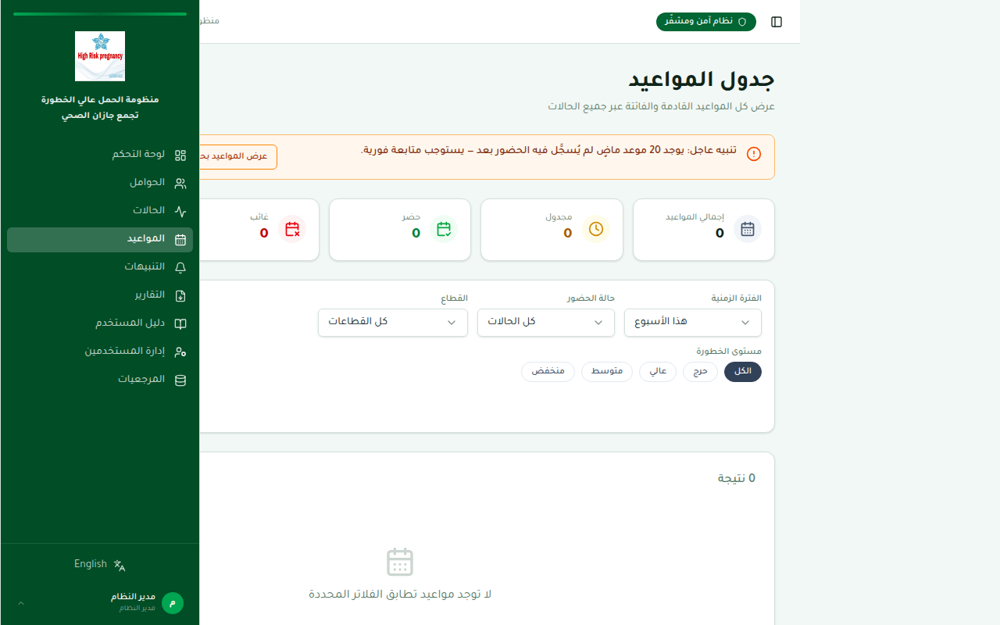

### 13. صفحة التنبيهات – قائمة الحالات الحرجة

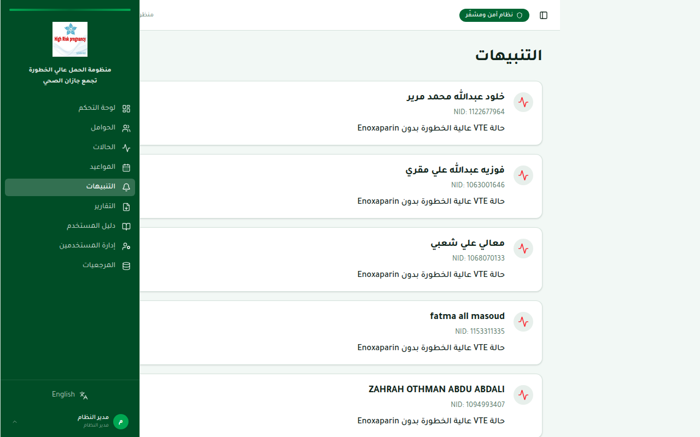

### 14. صفحة التقارير – خيارات تصدير بيانات المرضى والحالات

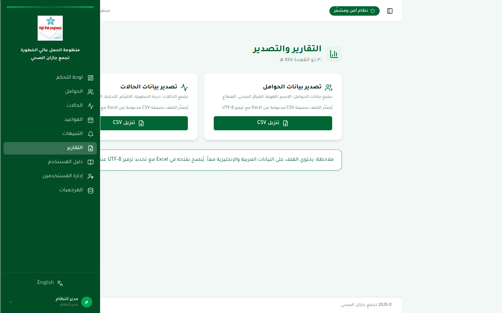

### 15. صفحة إدارة المستخدمين – قائمة الحسابات مع الأدوار

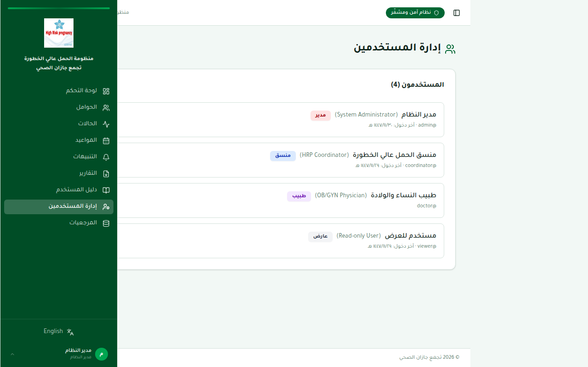

### 16. شاشة تسجيل الدخول في التطبيق المحمول

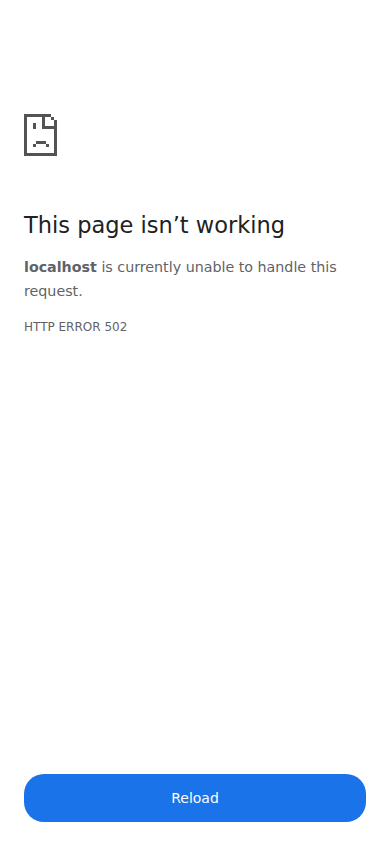
